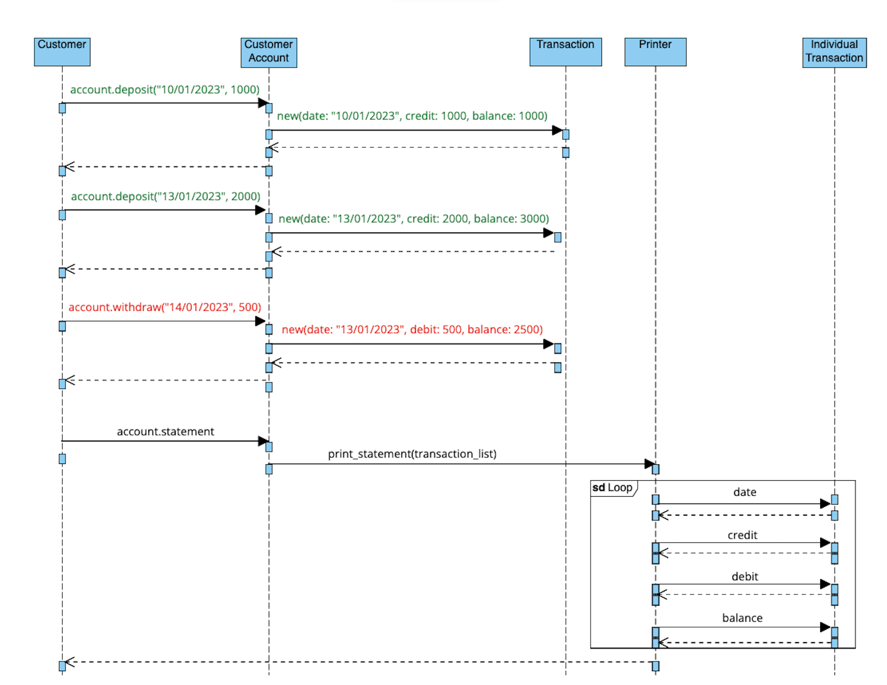
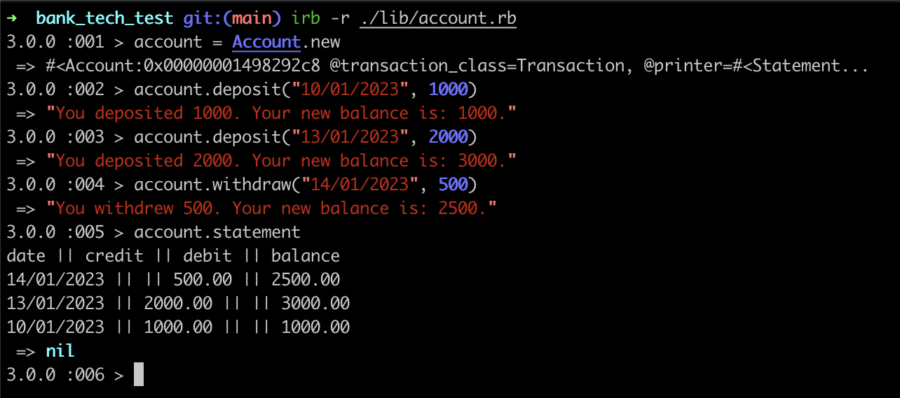

# Bank Tech Test

### Requirements

* You should be able to interact with your code via a REPL like IRB or Node.  (You don't need to implement a command line interface that takes input from STDIN.)
* Deposits, withdrawal.
* Account statement (date, amount, balance) printing.
* Data can be kept in memory (it doesn't need to be stored to a database or anything).

### Acceptance criteria

**Given** a client makes a deposit of 1000 on 10-01-2023  
**And** a deposit of 2000 on 13-01-2023  
**And** a withdrawal of 500 on 14-01-2023  
**When** she prints her bank statement  
**Then** she would see

```
date || credit || debit || balance
14/01/2023 || || 500.00 || 2500.00
13/01/2023 || 2000.00 || || 3000.00
10/01/2023 || 1000.00 || || 1000.00
```
## App Design
The App is split into 3 classes: 
- `Transaction`: defines the details for a single transaction. This includes date, credit/debit amounts, and a running account balance. 
- `Account`: creates a new instance of `Transaction` for each `#deposit` and `#withdrawal` made. `#statement` creates a new instance of `StatementPrinter` to generate the account statement at any given time.
- `StatementPrinter`: handles the printing and formatting of the account statement. The `#print_statement` method loops through each individual transaction stored on `Account` and outputs to the terminal. 



## Running the app

### Installation
Clone this repo:
```
$ git clone https://github.com/alastair10/bank_tech_test.git
```
Navigate to project file and install dependencies:
```
$ cd bank_tech_test
$ bundle install
```

### Usage
The user interacts with the app by providing the date and amounts of each transaction. 

To run the app in IRB via the terminal:
```
$ irb -r ./lib/accoun.rb
```
Create a new account:
```
$ account = Account.new
```
Making deposits and withdrawals:
```
$ account.deposit("10/01/2023", 1000)
$ account.deposit("13/01/2023", 2000)
$ account.withdraw("14/01/2023", 500)
```
Printing an account statement:
```
account.statement
```

### Testing
In the parent directory, run RSpec:
```
$ cd bank_tech_test
$ rspec
```

### App Preview


### Technologies
- Ruby
- RSpec